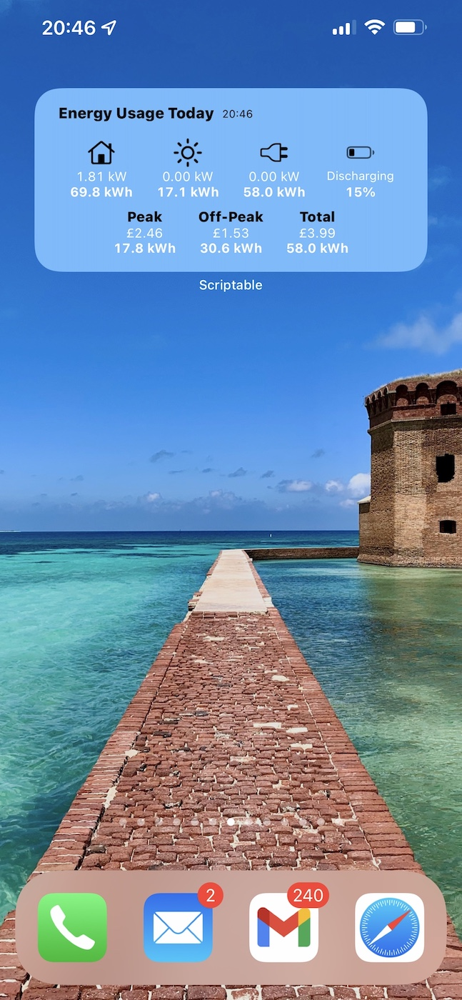

# Scriptable widget for showing GivEnergy usage data via Home Assistant and GivTCP

This repository contains code for a [Scriptable](https://scriptable.app/) widget (for iOS) which shows power 
and energy usage for home, solar, grid, and [GivEnergy](https://www.givenergy.co.uk/) battery storage, plus 
energy costs, fed from data aggregated by Home Assistant.

This widget can be added to the home screen of an iOS device and refreshes automatically to show "live" 
power and energy usage throughout the day, along with costs. See below for prerequisites and instructions on
how to configure the data sources.

## Prerequisites

There are several prerequisites:

- **[GivEnergy inverter](https://www.givenergy.co.uk/)** - you obviously need a GivEnergy inverter connected to
your local home network :)
- **[Home Assistant](https://www.home-assistant.io/)** - running on the same local network (e.g. on a Raspberry Pi or home server)
- **[GivTCP](https://github.com/GivEnergy/giv_tcp)** - this connects directly to your GivEnergy inverter and provides realtime data
via an MQTT broker that Home Assistant is able to read. This needs to be running on 
the same local network as your inverter (e.g. on a Raspberry Pi or home server)
- **iOS device for running this widget via the [Scriptable app](https://scriptable.app/)**

## Screenshot 

Here is a screenshot of the widget running on an iPhone:



## Notes

- It took me a while to get this working, and I may have missed an important step in the instructions below - if you believe 
this is the case please let me know and I'll update them!
- iOS limits the refresh rate of widgets on the home screen - it normally refreshes every few minutes, or sometimes longer
(I've seen up to 10-12 minutes between refreshes sometimes). I've included a timestamp on the widget so you can see when 
it was last refreshed. You can also configure the widget so that when it's tapped it runs the script, which will show 
the widget in a popup screen and cause the data to be refreshed.

## Instructions

1. Follow the installation instructions for [GivTCP](https://github.com/GivEnergy/giv_tcp) and set this up  
somewhere on your local network so that it's running 24/7. This runs inside a Docker container.
2. Once GivTCP is setup, you will need to define a few settings inside the `docker-compose.yml`:
   1. `INVERTOR_IP` - set the IP address of your GivEnergy inverter (assign a static IP to the inverter via your router if possible)
   2. `NUM_BATTERIES` - set the number of batteries connected to your GivEnergy inverter
   3. `MQTT_OUTPUT` - set this to `True` so Home Assistant is able to retrieve inverter data at regular intervals
3. If you don't already have [Home Assistant](https://www.home-assistant.io/), you will need to install this on a device
on your local network, such as a Raspberry Pi, home server, or NAS device. This can also run inside of Docker.
4. In Home Assistant, go to Configuration >> Devices & Services >> Integrations. Click on Add Integration, and search
for MQTT. In the settings for MQTT you will need to define the Broker options - this will be the IP address of the
device running GivTCP. If this is on the same device as Home Assistant you can use `127.0.0.1`. Also set the port number,
e.g. `1883`. This should detect all the different power and energy metrics provided by the GivEnergy inverter.
5. In the `configuration.yaml` for Home Assistant, you will need to enable the Utility Meter (for defining your tariffs),
and create some sensors that the Scriptable widget requires. Here are the full contents of my `configuration.yaml` as an
example. You will also need to change the peak and off-peak tariff rates in the code below.

```yaml
default_config:

# Text to speech
tts:
  - platform: google_translate

utility_meter:
  daily_energy:
    source: sensor.givtcp_import_energy_today_kwh
    name: Daily Energy
    cycle: daily
    tariffs:
      - peak
      - offpeak

script: !include scripts.yaml
scene: !include scenes.yaml
automation: !include automations.yaml

sensor:
  - platform: template
    sensors:
      daily_energy_cost_peak:
        unit_of_measurement: '£'
        friendly_name: Today's Peak Tariff Cost
        value_template: "{{ (states('sensor.daily_energy_peak') | float * 0.138 ) | round(2) }}"
       
  - platform: template
    sensors:
      daily_energy_cost_offpeak:
        unit_of_measurement: '£'
        value_template: "{{ (states('sensor.daily_energy_offpeak') | float * 0.05 ) | round(2) }}"
        friendly_name: Today's Off-Peak Tariff Cost

  - platform: template
    sensors:
      daily_energy_cost_all:
        unit_of_measurement: '£'
        value_template: "{{ (states('sensor.daily_energy_cost_peak') | float) + (states('sensor.daily_energy_cost_offpeak') | float) }}"
        friendly_name: Today's Total Cost

  - platform: template
    sensors:
      daily_energy_export_income:
        unit_of_measurement: '£'
        value_template: "{{ (states('sensor.givtcp_export_energy_today_kwh') | float * 0.041 ) | round(2) }}"
        friendly_name: Today's Export Income

  - platform: template
    sensors:
      total_energy_export_income:
        unit_of_measurement: '£'
        value_template: "{{ (states('sensor.givtcp_export_energy_total_kwh') | float * 0.041 ) | round(2) }}"
        friendly_name: All-Time Export Income

  - platform: template
    sensors:
      battery_state:
        value_template: >-
           Discharging
           Charging
           Idle
          
        friendly_name: Battery State
```

6. The `configuration.yaml` also references `automations.yaml` - create this file if it doesn't exist, and 
define the automations to ensure Home Assistant automatically switches tariffs at the appropriate times. For
example I am on the Octopus Go tariff from Octopus Energy, which has an off-peak period of 12:30am to 4:30am:

```yaml
- alias: Switch to off-peak tariff
  trigger:
  - platform: time
    at: "00:30:00"
  condition: []
  action:
  - service: utility_meter.select_tariff
    data:
      tariff: offpeak
    target:
      entity_id: utility_meter.daily_energy
  mode: single
  id: offpeak1

- alias: Switch to peak tariff
  trigger:
  - platform: time
    at: "04:30:00"
  condition: []
  action:
  - service: utility_meter.select_tariff
    data:
      tariff: peak
    target:
      entity_id: utility_meter.daily_energy
  mode: single
  id: peak1
```

7. The automations above will create triggers to automatically switch the tariff at the appropriate times, ensuring
Home Assistant correctly calculates your energy costs throughout the day. **Important:** Check to make sure Home Assistant 
is set to the right timezone (e.g. London). If it's set to UTC for example, the tariff will 
switch at the wrong time. You can check the timezone setting under Configuration >> Settings >> General.
8. In Configuration >> Dashboards >> Energy, configure the sensors for Electricity grid, Solar panels, and Home battery storage.
I used these settings:
   1. Grid consumption - `GivTCP Import Energy Today kWh`
   2. Return to grid - `GivTCP Export Energy Today kWh`
   3. Solar production - `GivTCP PV Energy Today kWh`
   4. Battery systems:
      1. Energy going in to the battery - `GivTCP Battery Charge Energy Today kWh`
      2. Energy coming out of the battery - `GivTCP Battery Discharge Energy Today kWh`
9. Restart Home Assistant and you should soon see data under the Overview and Energy sections.
10. Install Scriptable on your iOS device, and copy the code from `givenergy_widget.js` in this repository 
into a new Script within the Scriptable app. You will need to set the following variables in the code for it to work:
    1. `HOME_ASSISTANT_BASE_URL` - Set this to the main URL where your Home Assistant server is running, e.g. 
       `http://homeassistant.local`
    2. `HOME_ASSISTANT_ACCESS_TOKEN` - Go to your Profile settings in Home Assistant, scroll down to the Long-Lived
    Access Tokens section and generate a new token
11. Run the code in the Scriptable app, and it should hopefully show a widget containing usage data! 
12. You can add the widget to your home screen by long-pressing on your home screen until the icons start dancing and
you see a `+` button in the upper-left corner of the screen. Press this button and search for Scriptable, then select 
the medium size widget, and select the newly added script. You can also configure what happens when you tap the
widget on the home screen by setting "When Interacting" - I set mine to "Run Script", as this causes the widget
to load in a popup screen and refreshes the data.